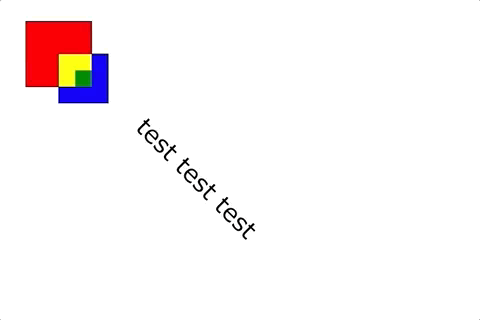

# visuals
React component library for quickly building brilliant visualizations.

## install

```sh
$ npm install visuals
```

```js
import Visuals from 'visuals';

const Demo = (
  <Visuals.Graph>
    <Visuals.Rect x={50} y={50} width={'10%'} height={'10%'} fill="red" stroke="black">
      <Visuals.Rect x={'50%'} y={'50%'} width={'75%'} height={'75%'} fill="blue" stroke="black" />
      <Visuals.Rect x={'50%'} y={'50%'} width={'50%'} height={'50%'} fill="yellow" >
        <Visuals.Rect x={'50%'} y={'50%'} width={'50%'} height={'50%'} fill="green" />
      </Visuals.Rect>
    </Visuals.Rect>
    <Visuals.Text x={420} y={460} text="test test test" rotate={{ angle: "45" }} textAnchor="middle" fontFamily="Verdana" fontSize="35" />
  </Visuals.Graph>
);

ReactDOM.render(Demo, document.getElementById('demo'));
```



## contributing

```sh
$ git clone https://github.com/joekent-cms-project/visuals.git
$ npm install

$ npm run storybook
$ npm run test # Coming soon
$ npm run lint # Coming soon
```
